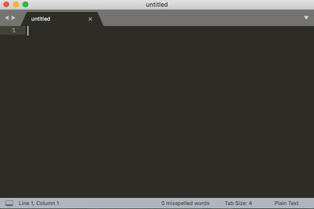

# Sublime Text 3 user defined snippets

This folder includes personally defined snippets. Place `st3-snippets` folder under _Sublime Text 3 > Data > Packages > User_, which can be accessed from _Preferences > Browse Packages_. On macOS, this would be under `"$HOME/Library/Application Support/Sublime Text 3/Packages/User"`.

## How snippets work

Type a pre-defined keyword, say, `fig` and press <kbd>tab</kbd>, and it produces a full block of figure LaTeX code. See a demonstration below.

